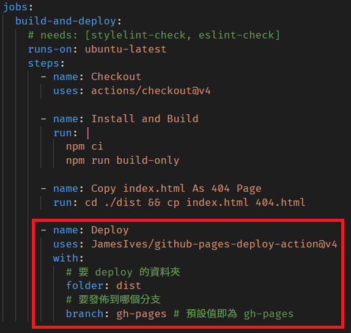
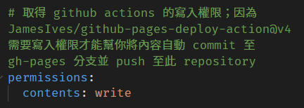
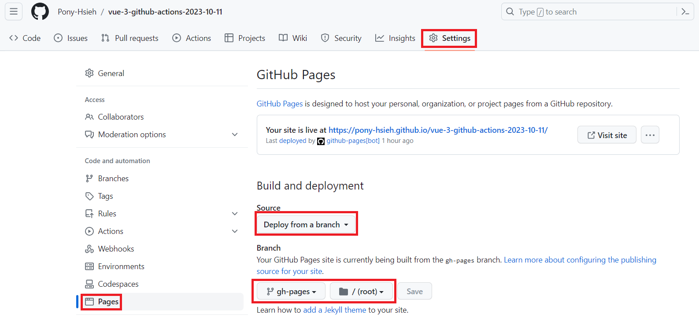
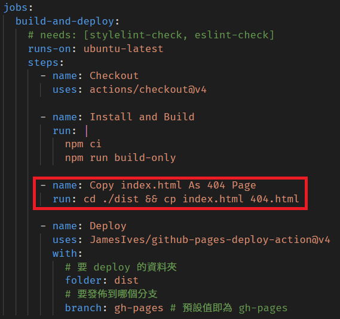

# 部署到 gh-page
## 部署流程
1. 透過 github actions 自動執行 ci, cd 流程  
   - 設定檔位置： `.github\workflows\main.yml`
     - 一定要放在 `.github\workflows` 這個資料夾底下，.yml 的檔名則可自行命名
   - 觸發時機(可以二擇一，或者是都做，皆可)
     1. 在 master 被 push 時
     2. 在 master 被 pull request 時
     - push 的事件也會在 pull request 時被觸發  
      (詳見參考文章)
2. 搭配 `JamesIves/github-pages-deploy-action@v4` 套件，自動將內容發布至 `gh-pages` 分支
   - 設定方式
    
   - 使用此套件需要 repository 寫入權限，設定方式之一如圖
    
3. 更新 `gh-pages` 分支後，github page 自動觸發 `pages-build-deployment` 這個 workflow，發布更新的內容
   - 設定方式
    
## 實測結果
- error 會終止 ci, cd 流程，warnig 不會
  
  
## 注意事項
- Set the correct `base` in `vite.config.js`  
  - 照著 [官方文件](https://vitejs.dev/guide/static-deploy.html#github-pages) 設定即可
- 部署 Vue SPA 專案至 GitHub pages ，並採用 `createWebHistory` 模式時(網址列中不會有 '#')，需在 github actions 設定檔中加上這個步驟，避免 vue router 導向頁面時出現 404
  
  - 如果使用 `createWebHashHistory` 模式，則不需要加上此步驟
  - 參考文章
    - [解決 SPA 部署到 GitHub pages 重新整理產生 404 的問題](https://blog.yyisyou.tw/8357407a/)
    - [Vue Router not working when deployed to github pages](https://stackoverflow.com/questions/73813752/vue-router-not-working-when-deployed-to-github-pages)
      > Github pages does not support SPA.  
      Use hash mode instead of web history.
    - [解决vue打包Github pages部署访问路由地址404问题（路由history模式）](https://blog.csdn.net/qq_21567385/article/details/107884942)


# ESLint
## 各種 plugin 及 config
- `@rushstack/eslint-patch`
  - `@rushstack/eslint-patch/modern-module-resolution`
  - A patch that improves how ESLint loads plugins when working in a monorepo with a reusable toolchain
- `eslint`
  - `eslint:recommend`
  - ESLint is a tool for identifying and reporting on patterns found in ECMAScript/JavaScript code. 
- `eslint-plugin-vue`
  - `plugin:vue/vue3-essential`
  - Official ESLint plugin for Vue.js
- `@vue/eslint-config-typescript`
  - 此套件的 dependencies 有以下三個，所以安裝此套件的時候，這三個套件也會一併安裝
    - `@typescript-eslint/eslint-plugin`
      - An ESLint plugin which provides lint rules for TypeScript codebases.
    - `@typescript-eslint/parser`
      - An ESLint parser which leverages TypeScript ESTree to allow for ESLint to lint TypeScript source code.
    - `vue-eslint-parser`
      - The ESLint custom parser for .vue files.
- `@vue/eslint-config-prettier`
  - `@vue/eslint-config-prettier/skip-formatting`
  - eslint-config-prettier for Vue
  - 此套件的 dependencies 有以下兩個，所以安裝此套件的時候，這兩個套件也會一併安裝
    - `eslint-config-prettier`
      - Turns off all rules that are unnecessary or might conflict with Prettier.
    - `eslint-plugin-prettier`
      - Runs Prettier as an ESLint rule and reports differences as individual ESLint issues.
## eslint configuration
- `--ext [String]`: Specify JavaScript file extensions


# 報錯
- a step cannot have both the `uses` and `run` keys
  - 如同字面意義所述，撰寫 github actions 設定檔時注意一下即可，或者是使用 github actions 報錯時再來修正也可


# 參考文章
- [团队协作（一）—— 你不知道的 ESLint + Prettier](https://juejin.cn/post/7137689028953899022)
- [贴心的 eslint 各配置项详解](https://www.jianshu.com/p/18b27d97a5e7)
- [span 等行内元素空格问题与 prettier.htmlWhitespaceSensitivity](https://juejin.cn/post/6844904194059534350)
  - 記得在 prettier 設定檔加入 `"htmlWhitespaceSensitivity": "ignore"`，不然 .vue 中的 template 排版會變得很奇怪
    - 未排版程式碼(直接壓成一行)
      ```html
      <v-textarea type="primary" html-type="submit" style="width: 100%" :loading="loading">登入</v-textarea>
      ```
    - 有加上此設定值
      ```html
      <v-textarea type="primary" html-type="submit" style="width: 100%" :loading="loading">
        登入
      </v-textarea>
      ```
    - 沒加上此設定值
      ```html
      <v-textarea type="primary" html-type="submit" style="width: 100%" :loading="loading"
        >登入</v-textarea
      >
      ```
- [git: 為什麼 pull request 不叫 push request ?](https://www.zhihu.com/question/263901073/answer/2693228178)  
  一般來說，一個正常的 pr 有以下幾步：
  1. fork
  2. 將自己（開發者）的程式碼 push 到自己的分支上
  3. 創建 pr
  4. 維護者看到 pr，將這些分支 pull 下來，merge 到主分支上（這裡面可能隱含了一次 push 操作）
  
  所以 pull request 的意思是：  
  請求維護者將開發者的程式碼 pull 下來，合併到主分支上
  
  當然，更合適的名詞是 merge request：請求維護者把開發者的程式碼合併到主分支上。（GitLab 上就叫 merge request）   
  但是，整體來說，push request 從直覺上來講是不太好的用詞。  
  從流程可以看出，雖說有 push 操作，但整體的操作核心還是 pull 和 merge